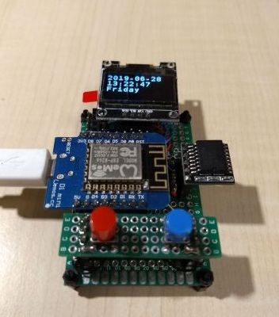

# OledClock

This is a USB-powered clock that supports 3 timezones using the AceTime library.
It contains:

* (1) MCU (e.g Nano, Pro Micro, ESP8266, or ESP32)
* (1) SSD1306 OLED display on I2C
* (1) DS3231 RTC chip on I2C
* (2) buttons on GPIO pins

## Schematic

Here is the rough schematic of this example:
```
            5V or 3V3
              / \
              | |
MCU           R R
+-----+       | |        DS3231
|     |       | |        +--------+
|  SCL|-------+-.--------|SCL     |
|  SDA|-------.-+--------|SDA     |
|     |       | |        +--------+
|     |       | |
|     |       | |        OLED (I2C)
|     |       | |        +--------+
|     |       +-.--------|SCL     |
|     |         +--------|SDA     |
|     |                  +--------+
|  D02|----S1---+
|  D03|----S2---+
+-----+         |
                |
               GND

R = 10k Ohms
S1, S2 = momentary buttons
D02, D03 = GPIO pins, could be assigned to some other pins
SCL, SDA = I2C pins
```

## Photo


