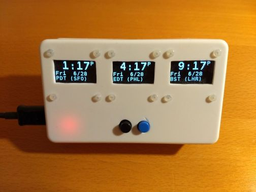

# WorldClock

This is a USB-powered clock that supports 3 timezones using the AceTime library.
It contains:

* (1) Arduino Pro Micro controller
* (3) OLED displays on SPI
* (1) DS3231 RTC chip on I2C
* (2) buttons on GPIO pins

